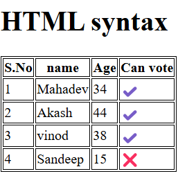

"# Back_End" 

Django:
   # intruduction to Django
      ASGI{Asynchrouns Server Gateway Interface}
      to create another app:
            #cmd: python manage.py startapp home{app name}
      to run server:
            #cmd:python maange.py runserver
      all logic in views files

      all routing in url files
   # Models and Migrate
      stored in models
      cmd ro migrate:
       python manage.py makemigrations
       python manage.py migrate

   # Django shell
     is an interactive env  for working with django project

     cmd: python manage.py shell
         
